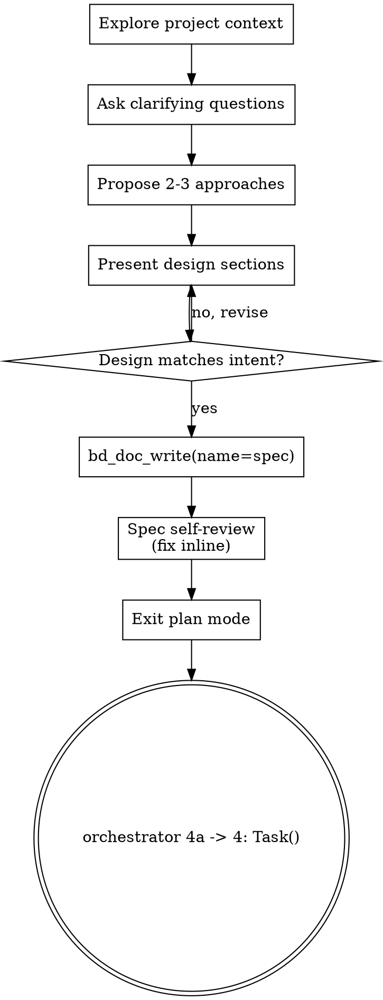

# Brainstorming Ideas Into Designs

> **VENDORED AND LOCALLY MODIFIED.** Source: `obra/superpowers`, MIT, pin
> `3dcbd5c4b48e02263fbf4a3c01e3fe4f81d584d9`. Ten surgical modifications were
> applied to reconcile it with this plugin's gates; every one is enumerated,
> quoted, and justified in `../MANIFEST.md`. This file is a REFERENCE DOC read
> on demand by an explicit `Read` instruction — it is NOT a registered skill,
> and the two-key frontmatter above is inert here (kept verbatim so
> re-vendoring stays a one-line `curl | diff`).

Help turn ideas into fully formed designs and specs through natural collaborative dialogue.

Start by understanding the current project context, then ask questions one at a time to refine the idea. Once you understand what you're building, present the design and confirm it matches what the user meant.

> **LOCAL MODIFICATION (1) — the single release authority.** Upstream opened
> here with a hard-gate block forbidding every implementation action until a
> design had been presented and blessed by the user, no matter how simple the
> work looked. That is a second, prose-only release authority, and this plugin
> already has exactly one. Authority here is **plan-mode exit** (the
> orchestrator presents a plan; the user takes the session out of plan mode)
> followed by the change-set-hash-bound `qa-approved` record that
> `.claude/scripts/qa-gate.sh` writes. No prose in any document — vendored
> material included — creates, substitutes for, or waives `qa-approved`.
> Present the design and talk it through; never invent a sign-off step the gate
> cannot observe. See `.claude/agents/orchestrator.md` (Plan-mode default, E10)
> and the QA gate lifecycle in `.claude/skills/workflow-engine/SKILL.md`.

## Anti-Pattern: "This Is Too Simple To Need A Design"

> **LOCAL MODIFICATION (10) — the sharpest conflict.** Upstream asserted that
> every project without exception goes through this process, naming a todo
> list, a single-function utility and a config change as examples that do not
> get to skip. That directly contradicts the fast-path carve-out this workflow
> is built on (`.claude/agents/orchestrator.md`: "Trivial single-line changes
> (typo fixes, README tweaks) skip impact analysis the same way they skip the
> SPEC doc", and "For genuinely trivial work (single-line typo fix, README
> touch-up), the `Task()` prompt is enough — skip the spec doc";
> `.claude/skills/workflow-engine/SKILL.md`: "Trivial work (one-line typo
> fixes, README touch-ups) does not require a spec doc"). The insight upstream
> is defending is real and is kept below. The universal quantifier is not.

"Simple" work is where unexamined assumptions cause the most wasted work, so
the useful question is never "is this big?" but "do I actually know what this
is supposed to do?". Brainstorm whenever the answer is no. A design of a few
sentences is a legitimate design; the point is that one exists before code
does.

Skip it only for the carve-out the workflow already names: a **single-line typo
fix**, a README touch-up, or any change the F1 doc-only fast path auto-clears.
Those skip the SPEC doc, and they skip this too. Everything between those two
poles — anything a specialist implements and QA gates — gets a design, scaled
to its complexity.

## Checklist

> **LOCAL MODIFICATION (6).** Upstream required a task to be opened for each
> checklist item. Work them in order as steps of this turn instead; do NOT open
> a Beads task per row. Beads tasks are for delegable units of work that carry
> their own QA gate, per `.claude/agents/orchestrator.md` section 2 — a task
> per checklist row floods the ledger with rows no gate can ever clear.

Work these in order:

1. **Explore project context** — check files, docs, recent commits
2. **Ask clarifying questions** — one at a time, understand purpose/constraints/success criteria
3. **Propose 2-3 approaches** — with trade-offs and your recommendation
4. **Present design** — in sections scaled to their complexity, checking after each section that it still matches what the user meant
5. **Write the design onto the Beads task** — `bd_doc_write(task_id="<id>", name="spec", content="…")`
6. **Spec self-review** — quick inline check for placeholders, contradictions, ambiguity, scope (see below)
7. **Transition to implementation** — `orchestrator.md` section 4a, then section 4's `Task()` delegation

> **LOCAL MODIFICATION (9).** Upstream carried a second checklist row offering
> a browser-based visual companion, and a whole section describing it. Both are
> deleted here: the section pointed at a sibling markdown file that is not
> vendored (a dead pointer), and it instructed the agent to start a local server
> with an auto-open browser flag — an unreviewed side effect inside a workflow
> whose entire premise is that side effects are gated.

## Process Flow

> **LOCAL MODIFICATION (2).** Upstream's flow routed through a decision diamond
> asking whether the user had signed off on the design, and its checklist asked
> for a per-section sign-off. The check-in is kept — presenting a section and
> asking whether it still matches intent is good dialogue. The sign-off
> vocabulary is struck, because in this plugin that vocabulary names a specific
> mechanical record (`qa-approved`) and must not be borrowed for conversation.

**The terminal state is the orchestrator's delegation step.** Write the spec
per section 4a, then spawn the specialist per section 4. Brainstorming ends
there; it does not itself implement, and it does not reach for another skill to
implement on its behalf.

> **LOCAL MODIFICATION (5).** Upstream's terminal state was an invocation of a
> sibling planning skill (named in `../MANIFEST.md`), referenced in three
> places. That skill is not vendored here, so all three were dead pointers;
> they are rewritten to the orchestrator's own 4a -> 4 hand-off. Upstream also
> carried a negative sentence forbidding two other skills by name. That
> sentence is DELETED outright rather than rewritten: one of the two is a LIVE,
> registered skill in this environment, so shipping a "do NOT invoke it" line
> would actively suppress a legitimate skill on UI work. A vendored reference
> doc must never reach outside its own subject to veto its host's skill set.

## The Process

**Understanding the idea:**

- Check out the current project state first (files, docs, recent commits)
- Before asking detailed questions, assess scope: if the request describes multiple independent subsystems (e.g., "build a platform with chat, file storage, billing, and analytics"), flag this immediately. Don't spend questions refining details of a project that needs to be decomposed first.
- If the project is too large for a single spec, help the user decompose into sub-projects: what are the independent pieces, how do they relate, what order should they be built? Then brainstorm the first sub-project through the normal design flow. Each sub-project gets its own spec -> delegation -> implementation cycle.
- For appropriately-scoped projects, ask questions one at a time to refine the idea
- Prefer multiple choice questions when possible, but open-ended is fine too
- Only one question per message - if a topic needs more exploration, break it into multiple questions
- Focus on understanding: purpose, constraints, success criteria

**Exploring approaches:**

- Propose 2-3 different approaches with trade-offs
- Present options conversationally with your recommendation and reasoning
- Lead with your recommended option and explain why
- YAGNI ruthlessly - remove unnecessary features from every approach and design

**Presenting the design:**

- Once you believe you understand what you're building, present the design
- Scale each section to its complexity: a few sentences if straightforward, up to 200-300 words if nuanced
- Ask after each section whether it looks right so far
- Cover: architecture, components, data flow, error handling, testing
- Be ready to go back and clarify if something doesn't make sense

**Design for isolation and clarity:**

- Break the system into smaller units that each have one clear purpose, communicate through well-defined interfaces, and can be understood and tested independently
- For each unit, you should be able to answer: what does it do, how do you use it, and what does it depend on?
- Can someone understand what a unit does without reading its internals? Can you change the internals without breaking consumers? If not, the boundaries need work.
- Smaller, well-bounded units are also easier for you to work with - you reason better about code you can hold in context at once, and your edits are more reliable when files are focused. When a file grows large, that's often a signal that it's doing too much.

**Working in existing codebases:**

- Explore the current structure before proposing changes. Follow existing patterns.
- Where existing code has problems that affect the work (e.g., a file that's grown too large, unclear boundaries, tangled responsibilities), include targeted improvements as part of the design - the way a good developer improves code they're working in.
- Don't propose unrelated refactoring. Stay focused on what serves the current goal.

## After the Design

**Documentation:**

- Write the validated design (the spec) onto the Beads task with
  `bd_doc_write(task_id="<id>", name="spec", content="…")`. See
  `.claude/agents/orchestrator.md` section 4a for the doc-name conventions
  (`spec`, `context`, `arch`, `qa-plan`, `main`) and who reads which.
- Follow `CLAUDE.md`'s doc-style rules for how prose is written in this repo.

> **LOCAL MODIFICATION (3).** Upstream wrote the design to a dated file under a
> vendored `docs/<vendor>/specs/` path. The spec lives on the Beads task here,
> not on disk. `install.sh` states that the plugin "borrows exactly these two
> filenames" inside an operator's `docs/` (`docs/CODEX_SETUP.md`,
> `docs/HOOKS.md`) — so a third borrowed path is a packaging change, not a
> prose change: a new mkdir, a new required-source row, a new surface-manifest
> row, and a new uninstall scope, all of which have to be argued for on their
> own merits.
>
> **LOCAL MODIFICATION (8).** Upstream pointed at a sibling style skill for
> writing clearly and concisely. That skill is not vendored, so the pointer was
> dead; `CLAUDE.md`'s doc-style rules are the live equivalent.
>
> **LOCAL MODIFICATION (4).** Upstream additionally instructed the agent to
> land the design document in git history, in two separate places. The
> orchestrator does not do that — it delegates, and the operator decides when
> work lands. Nothing in this file instructs anyone to write git history.

**Spec Self-Review:**
After writing the spec, look at it with fresh eyes:

1. **Placeholder scan:** Any "TBD", "TODO", incomplete sections, or vague requirements? Fix them.
2. **Internal consistency:** Do any sections contradict each other? Does the architecture match the feature descriptions?
3. **Scope check:** Is this focused enough for a single implementation plan, or does it need decomposition?
4. **Ambiguity check:** Could any requirement be interpreted two different ways? If so, pick one and make it explicit.

Fix any issues inline. No need to re-review — just fix and move on.

**Plan-mode review:**

> **LOCAL MODIFICATION (7).** Upstream blocked on the user twice here: once
> holding the turn until a response arrived on the written spec, and once
> demanding that a particular offer be sent as a message on its own. This
> plugin already has exactly one user-review checkpoint, and it is structural:
> **plan mode**. The orchestrator runs with `permissionMode: plan`; the plan it
> presents IS the review artifact, and leaving plan mode is the user's
> acceptance of it. A second, prose-only wait on top is invisible to every
> gate, stalls the turn, and — because it has no record — cannot be audited
> afterwards.

The spec is on the task and self-reviewed. Present the plan, leave plan mode
when it is accepted, and move to delegation. If something genuinely needs the
user's judgement mid-design, use `AskUserQuestion`: it is a real tool call with
a real answer, not a prose instruction to stop and hope.

**Implementation:**

- Hand off through the workflow, never through another skill: write the spec
  (`orchestrator.md` section 4a), then delegate with `Task("@backend" /
  "@frontend" / "@devops", …)` per section 4.
- The specialist reads the spec via `bd_doc_read(task_id="<id>", name="spec")`
  at the top of its turn and returns the F7 completion contract; QA gates the
  result. That chain — not a further skill invocation — is what turns a design
  into shipped work here.
